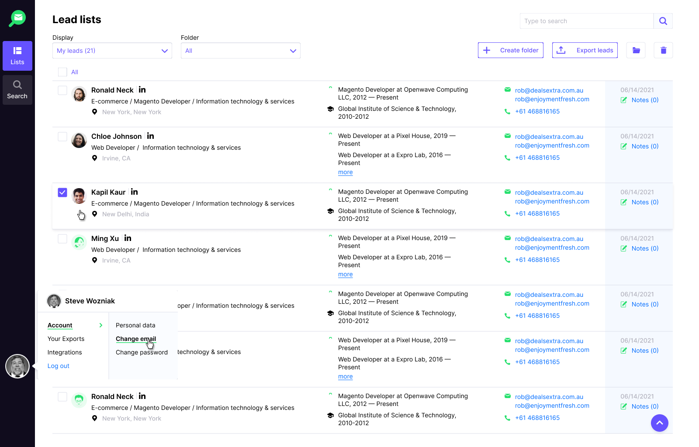
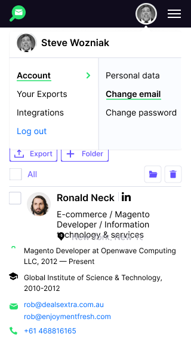

# ReactJS Coding Challenge

The main goal of this challenge is to get a sense of your coding style and choices. Please assume that this code will go to production, so apply any relevant engineering practices.

The code challenge does not involve any exotic or bleeding-edge technologies, tools, etc. and that’s the point: We’d like to focus on your code style and not get distracted.

There are no "right" or "wrongs", all we want to see is how you like to code. It's not necessary to do everything listed in the task but please provide enough code so that we are able to understand your current abilities.

Treat the challenge as a guideline, you're welcome to customise it but please provide some explanation why.

That also allows us to have a more fruitful and constructive discussion at the technical interview. We’re not fans of white-boarding at interviews, so we’d much rather have some concrete code to talk about. We think that makes the interview much more enjoyable and productive.

There are a lot of elements in the design so it's not necessary to finish the whole thing, what is important is to see how you work and how you break it down.

# Your challenge/task

- [ ] Build the Sidebar nav and Account Settings popover with the menu
- [ ] Clicking `Lists` should update the URL to `/lists` and just show a blank page with the text "this is the lists page".
- [ ] Clicking `Search` should update the URL to `/search` and just show a blank page with the text "this is the search page"
- [ ] Clicking the avatar should show the menu
- [ ] Clicking `Account` should highlight the `Account` with underline and arrow
- [ ] Show the `account-submenu` when `Account` is active
- [ ] Clicking away should reset state and hide the popover
- [ ] Clicking the other menu items `Your Exports`, `Integrations`, `Log out` do nothing (or something, that'll be up to you)

## Bonus Points
* Mobile layout

## Notes
We are here to answer any questions you might have so please just email.
We also value feedback, if there are things we could do better, please let us know.